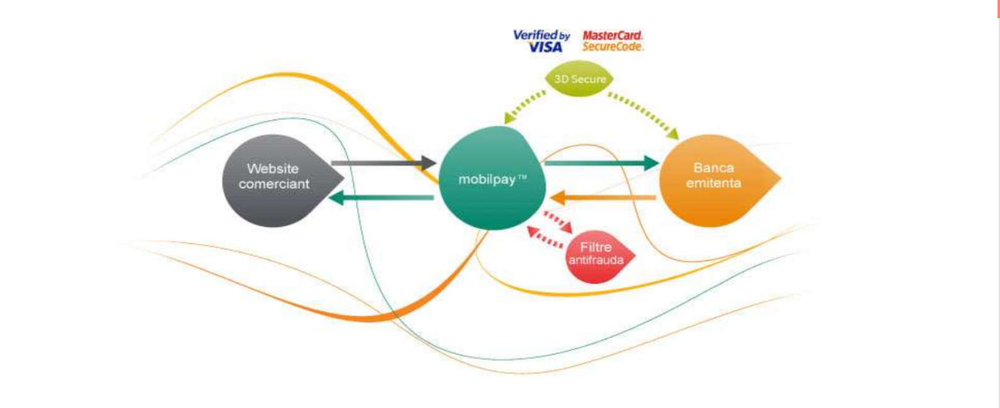

# NETOPIA Payments API

## Card Payment Module in PHP language
This module made to use as an example of implementation for online payment via Card in PHP 

## Generic Payment Request/Response Flow

The user will be redirected from the Merchant's website to NETOPIA Payments server together with a payment request. Based on the merchant account settings in NETOPIA's platform, various payment input methods might be displayed (e.g. Google Pay)

- ### Payment request 
    You need to send Payment request to NETOPIA Payments by using **POST Method** including 2 variable **env_key** and **data**
    - env_key : envelope key
payment encryption
    - data : encrypted data
 (see the openssl_seal function in PHP)
    
## Where to send the Request
- Live : https://secure.mobilpay.ro
- Sandbox : https://sandboxsecure.mobilpay.ro
(only HTTP POST requests accepted)

## Payment Request Structure
In order to send the payment request to NETOPIA Payments , you need to encrypt the payment data on **POST** method and encapsulate the information using the following structure.  

        <?xml version="1.0" encoding="utf-8"?>
        <order type="card" id="string64" timestamp="YYYYmmddHHiiss">
            <signature>XXXX-XXXX-XXXX-XXXX-XXXX</signature>
            <invoice currency="RON" amount="XX.YY" installments="R1,R2"
            selected_installments="R2" customer_type="2"
            customer_id="internal_id" token_id="token_identifier"
            pan_masked="NNNN">
                

                    Payment Details
                

                <contact_info>
                    <billing type="company|person">
                        <first_name>first_name</first_name>
                        <last_name>last_name</last_name>
                        <email>email_address</email>
                        <address>address</address>
                        <mobile_phone>mobile_phone</mobile_phone>
                    </billing>
                </contact_info>
            </invoice>
            <params>
                <param>
                    <name>param1Name</name>
                    <value>param1Value</value>
                </param>
            </params>
            <url>
                <confirm>
                    http://www.your_website.com/confirm
                </confirm>
                <return>
                    http://www.your_website.com/return
                </return>
            </url>
        </order>
- ### Confirm URL
    The confirm URL will be used for IPN (Instant Payment Notification) - i.e. to send information about the transaction's status.
- ### Redirect URL
    The redirect URL will be used to redirect User/Customer back to the Merchant's website from NETOPIA Payments (from the payment page, after the payment is done)

## Payment Response Structure
The response from NETOPIA Payments to your confirm URL will be in following structure

    <?xml version="1.0" encoding="utf-8"?>
    <order type="card" id="string64" timestamp="YYYYMMDDHHMMSS">
    {your_request_XML}
        <mobilpay timestamp="YYYYMMDDHHMMSS" crc="XXXXX">
            <action>action_type</action>
            <customer type="person|company">
                <first_name>first_name</first_name>
                <last_name>last_name</last_name>
                <address>address</address>
                <email>email_address</email>
                <mobile_phone>phone_no</mobile_phone>
            </customer>
            <purchase>mobilPay_purchase_no</purchase>
            <original_amount>XX.XX</original_amount>
            <processed_amount>NN.NN</processed_amount>
            <pan_masked>X****YYYY</pan_masked>
            <payment_instrument_id>ZZZZZZZ</payment_instrument_id>
            <token_id>token_identifier</token_id>
            <token_expiration_date>YYYY-MM-DD HH:MM:SS</token_expiration_date>
            <error code="N">error_message</error>
        </mobilpay>
    </order>

## Merchant's Response
For each call to your confirm URL, the Merchant will need to respond in XML format back to NETOPIA Payments, in order to help us understand whether you have successfully recorded the response or not.

For debugging purposes, you may view your response in mobilPay console (Order – Details – Merchant Communication Log)

The following annotated description of the XML response structure shows the elements sent by you to the NETOPIA Payments API.

    <?xml version="1.0" encoding="utf-8" ?>
    <crc error_type=”1|2” error_code=”{numeric}”>{message}</crc>

The attributes of the crc element are only sent if you had any problem recording
the **IPN**.
- ### error_type 
    - set error_type  to "1", if there is a temporary error (this means that a retry mechanism will be activated and the IPN will be attempted again later on)
    - set error_type  to "2", if there is a permanent error

- ### error_code
    This is your internal error code. If error_code is 0, then everything went fine on your end. Otherwise, based on error_type, there might be one or more retries (up to 20)
- ### message
    Your message, to helping you find the error.

## Security
The messages exchanged with NETOPIA Payments are protected to ensure that only authorized requests are done.

There are three levels of security:
1. Request authentication using an API Signature included in the request (Signature field)

2. The data exchanged between the client → NETOPIA Payments server and back is encrypted using RSA keys

3. Secure Sockets Layer (SSL) data transport for the request, optional, if available
on the merchant side, for the response.

NETOPIA Payments API service is supporting the **3-D Secure** transactions (both v1 and v2)

### APPENDIX
#### Error Code Values
    0 – approved
    16 – card has a risk (e.g. stolen card)
    17 – card number is incorrect
    18 – closed card
    19 – card is expired
    20 – insufficient funds
    21 – cVV2 code incorrect
    22 – issuer is unavailable
    32 – amount is incorrect
    33 – currency is incorrect
    34 – transaction not permitted to cardholder
    35 – transaction declined
    36 – transaction rejected by antifraud filters
    37 – transaction declined (breaking the law)
    38 – transaction declined
    48 – invalid request
    49 – duplicate PREAUTH
    50 – duplicate AUTH
    51 – you can only CANCEL a preauth order
    52 – you can only CONFIRM a preauth order
    53 – you can only CREDIT a confirmed order
    54 – credit amount is higher than auth amount
    55 – capture amount is higher than preauth amount
    56 – duplicate request
    99 – generic error

